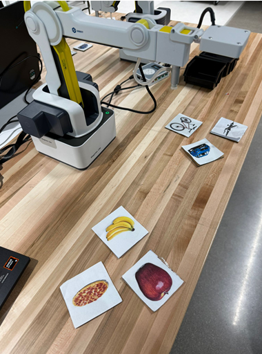
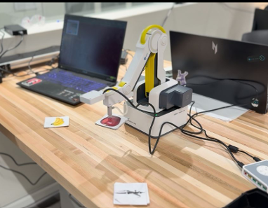

# Vision-Guided Robotic Sorting with YOLOv8

**Name:** Harish Anand  
**Institution:** Ira A. Fulton Schools of Engineering, Arizona State University, Tempe, USA

---

## Abstract

This work presents a real-time computer vision–based palletizing system using a Dobot Magician Lite robot equipped with a suction gripper and an overhead camera. The YOLOv8 deep learning framework was implemented to detect and classify printed images of food items (apple, banana, pizza) and vehicles (car, bicycle, airplane). Classified objects were picked using suction and placed into designated pallets.

Experimental results demonstrated reliable detection, accurate classification, and consistent pick-and-place cycles, validating the effectiveness of suction gripping for lightweight planar objects. The study provides a scalable framework for extending vision-guided robotic palletization to more complex multiclass and industrial applications.

**Robot Serial Number:** DT15-2311-1655

---

## I. Introduction

Autonomous palletizing is a fundamental task in industrial robotics, where perception and manipulation must be integrated for reliable sorting operations. Traditional palletizing relies on predefined motions, but the incorporation of computer vision allows robots to adapt to variable inputs and execute tasks with greater flexibility.

In this exercise, a Dobot Magician Lite robot equipped with a suction gripper and an overhead camera was used to implement a vision-guided palletizing system. YOLOv8 was employed to detect and classify representative images of food items and vehicles, which were then picked and placed into their respective pallets.

---

## II. Problem Statement

The objective is to implement an autonomous palletizing system that integrates real-time object detection with robotic manipulation. The task requires the robot to:
- Identify objects at a fixed pickup location using YOLOv8
- Classify them into two categories: **food** (apple, banana, pizza) and **vehicles** (car, bicycle, airplane)
- Place them into their respective pallets

---

## III. Procedure

### A. Hardware Setup
- Dobot Magician Lite robotic arm with suction gripper
- Overhead USB camera fixed for top-down view of the pickup location
- Pallet A — designated for food items
- Pallet B — designated for vehicles

### B. System Preparation
- Ubuntu environment updated with camera utilities (`v4l-utils`, `ffmpeg`, `cheese`)
- Robot communication via Linux `/dev/ttyUSB*` interface
- `pydobot2` library used for serial communication
- YOLOv8 configured for real-time object detection

### C. Calibration of Robot Poses
Four essential robot poses were defined:

| Pose | Description |
|------|-------------|
| HOME | Neutral reference position for initialization and reset |
| PICKUP | Coordinates of the marked pickup spot with hover and low Z-levels |
| PALLET A DROP | Center coordinates of the food pallet with safe-Z clearance |
| PALLET B DROP | Center coordinates of the vehicle pallet with safe-Z clearance |

Safe-Z trajectories were enforced to prevent collisions during transitions.

### D. Experimental Execution
During each trial, a printed card representing one of the six target objects was placed at the pickup location. The camera feed was processed by YOLOv8, which classified the object. Based on the classification, the robot:
1. Performed a suction-based grasp
2. Lifted the object to a safe height
3. Transported it to the appropriate pallet
4. Released suction and returned to HOME

---

## IV. Results and Discussion

### A. Sorting Performance

| Object | Class | Pallet | Correct Placement | Cycle Time (s) |
|--------|-------|--------|:-----------------:|:--------------:|
| Banana | Food | A | ✓ | 10.8 |
| Apple | Food | A | ✓ | 10.5 |
| Pizza | Food | A | ✓ | 11.1 |
| Car | Vehicle | B | ✓ | 10.2 |
| Bicycle | Vehicle | B | ✓ | 10.6 |
| Airplane | Vehicle | B | ✓ | 10.9 |
| **Overall** | – | – | **6/6** | **10.7 ± 0.3** |

### B. Discussion
- YOLOv8 achieved reliable classification even with variations in lighting and card positioning
- The suction gripper proved effective for lightweight, planar objects
- Calibration of Z-heights was critical — improper values led to suction failure or collision risk
- Safe-Z transitions before lateral motion minimized the risk of dragging objects

---

## V. Reflection and Lessons Learned

- Precise calibration of robot poses, especially pickup and drop Z-heights, proved essential
- Lighting conditions influenced YOLOv8 detection accuracy
- Robust error handling was needed for camera feed interruptions
- The exercise reinforced the interplay between computer vision, robot kinematics, and hardware reliability

---

## VI. Conclusion

The experiment successfully demonstrated an autonomous palletizing framework integrating YOLOv8-based object detection with robotic manipulation. The system reliably classified food and vehicle images, executed suction-based pick-and-place operations, and sorted them into designated pallets with high accuracy (6/6). The approach provides a scalable foundation for multi-class sorting and industrial palletization tasks.

---

## Demo Video

[Watch on YouTube](https://youtu.be/i6fPfXz0Chs)

---

## References

1. Ultralytics, "YOLOv8 Documentation," https://docs.ultralytics.com/
2. Z. Materna, "pydobot2: Python library for Dobot Magician," https://pypi.org/project/pydobot2/
3. Dobot, "Dobot Magician Lite User Manual"

## Demo Images

